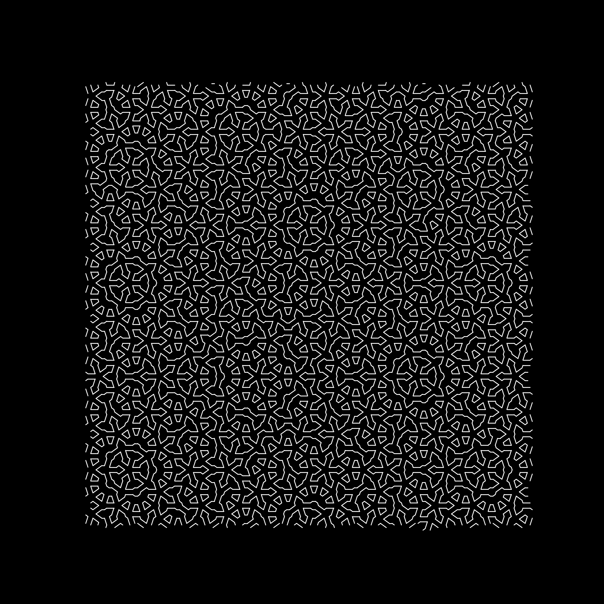
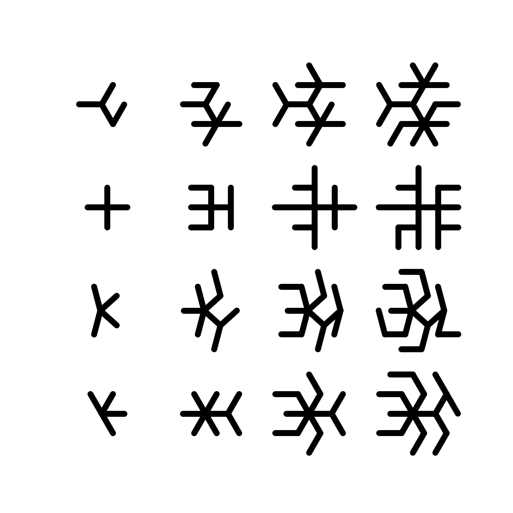
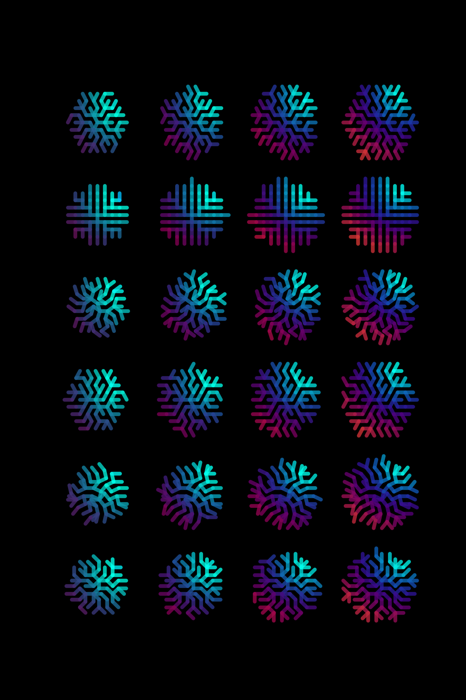

# Readme:
A simple implementation of the deBuijn method for non periodic tilings of the plane.

Bruijn, de, N. G. (1981). Algebraic theory of Penrose's non-periodic tilings of the plane.
Indagationes Mathematicae, 43(1), 39-66.

See also
  https://github.com/neozhaoliang/pywonderland/blob/master/src/aperiodic-tilings/debruijn.py
  for another implementation, much more "professional" and pythonic,
  but with a different display style.

 Another valuable site : https://www.mathpages.com/home/kmath621/kmath621.htm


## Preferred installation 

```
source .venv/bin/activate
pip install -r requirements.txt
```


## Usage

To run the script, use the following command:

```sh
python main.py -c <config_file_path> -g <function_name>
```

### Arguments
- `-c`, `--config`: Path to the configuration file (default: `configs/config_polo.json`).
- `-g`, `--go`: Name of the function to run (default: `goAllDefaults`).
- `-N`, `--N`: lenght of gamma (default: `5`).

### Example

To run the script with a different configuration file and function, use the following command:

```sh
python main.py -c configs/config_mike.json -g goVerySmall
```

## The demo

The following code:
```sh
python main.py -g goDemo
``` 
returns the following graph:





## Glyphs

An example of function calling is:

```sh
python main.py -g go_glyph
```

This will read the default config file. With a little trial and error, one can get this kind of graphs:



