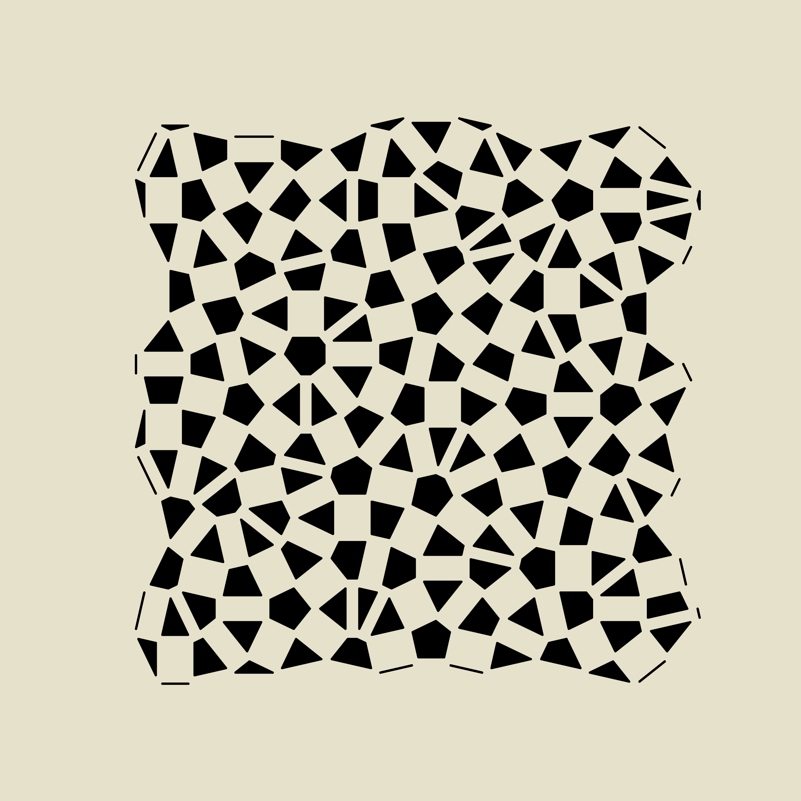
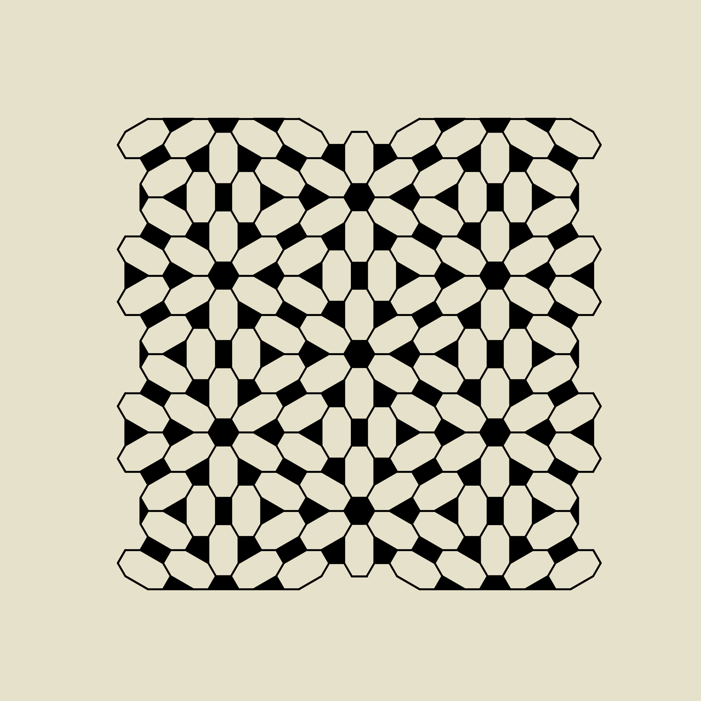

# Readme:
A simple implementation of the deBuijn method for non periodic tilings of the plane.

Bruijn, de, N. G. (1981). Algebraic theory of Penrose's non-periodic tilings of the plane.
Indagationes Mathematicae, 43(1), 39-66.

See also
  https://github.com/neozhaoliang/pywonderland/blob/master/src/aperiodic-tilings/debruijn.py
  for another implementation, much more "professional" and pythonic,
  but with a different display style.

 Another valuable site : https://www.mathpages.com/home/kmath621/kmath621.htm


## Preferred installation 

```
source .venv/bin/activate
pip install -r requirements.txt
```


## Usage

To run the script, use the following command:

```sh
python main.py -c <config_file_path> -g <function_name>
```

### Arguments
- `-c`, `--config`: Path to the configuration file (default: `configs/config_polo.json`).
- `-g`, `--go`: Name of the function to run (default: `goAllDefaults`).
- `-N`, `--N`: lenght of gamma (default: `5`).

### Example

To run the script with a different configuration file and function, use the following command:

```sh
python main.py -c configs/config_mike.json -g goVerySmall
```

## The demo

The following code:
```sh
python main.py -g goDemo
``` 
returns the following graph:


## Glyphs

An example of function calling is:

```sh
python main.py -g goGlyphs
```

This will read the default config file. With a little trial and error, one can get this kind of graphs:


## Neighbours

### Neighbours, descriptions and parameters

Building on the precedent stream of work, the graph is extracted from the tiling.
For each vertex of the graph, one draws a polygon that join, for each edge from the vertex, a point on this edge at distance `k` from the vertex.

By default, edges between the polygons are plotted.
This can be changed with the `"draw_edges"` key in the config file.

By default, the distance `k` is 0.333. 
This can be changed with the `"k"` key in the config file.

See `go_neighbours.py` for implementation details.

### Examples

An example of function calling is:

```sh
python main.py -g goNeighbours -c configs/config_polo_neighbours.json
```



Note that on the example above, there is no edge between the polygons.
This is because in the config called, the key `"draw_edges"` is at `"False"`.


One can also change the N via command line, for example:

```sh
python main.py -g goNeighbours -N 6 
```

